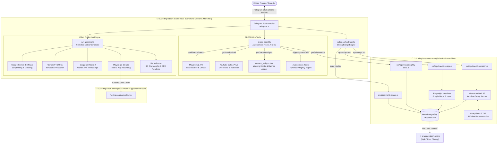
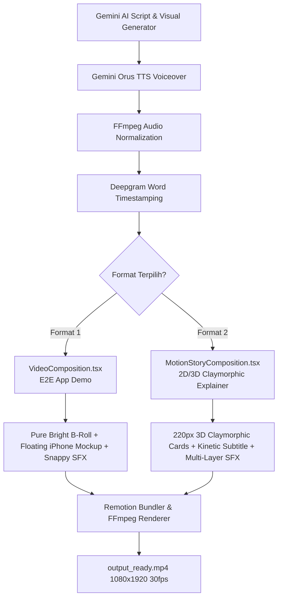
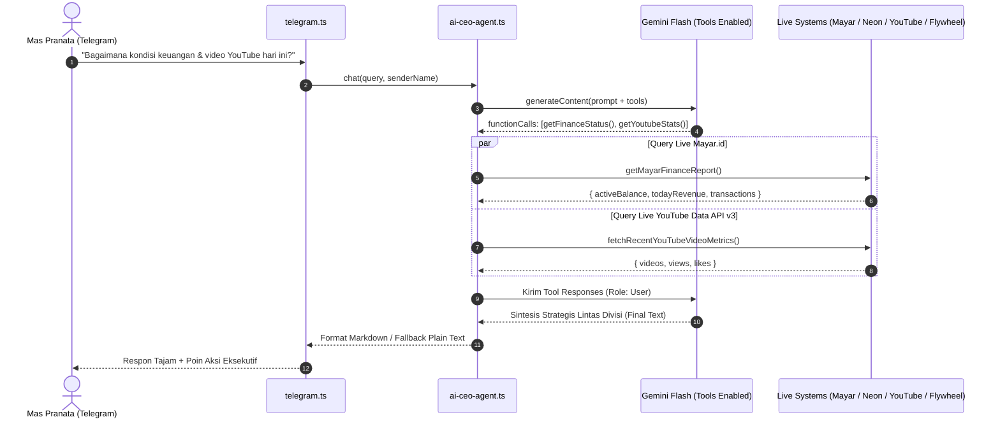

# 🏗️ Arsitektur Sistem: PJTech Autonomous & Sibling Orchestrator

Dokumen ini menjelaskan arsitektur teknis menyeluruh dari ekosistem **PJTech Autonomous Solopreneur**, termasuk pola integrasi **Sibling Orchestrator** yang menghubungkan modul pemasaran video (`pjtech-autonomous`) dengan modul jemput bola sales B2B (`one-sales-man`).

---

## 🧭 Gambaran Umum Arsitektur

Sistem ini didesain menggunakan prinsip **Modular Multi-Repo (Sibling Orchestrator)**. Setiap proyek mandiri berada di foldernya masing-masing di dalam direktori `D:\Coding\`, menjaga dependensi, versi pustaka, dan konfigurasi runtime tetap bersih dan terisolasi tanpa perlu disatukan menjadi satu monolithic repo yang rumit.



---

## ⚙️ Cara Kerja Sibling Orchestrator

Orchestrator diimplementasikan di [sales-orchestrator.ts](file:///d:/Coding/pjtech-autonomous/video-engine/src/sales-orchestrator.ts) menggunakan modul bawaan Node.js `child_process` (`spawn` dan `exec`). 

### 1. Deteksi Jalur Relatif (*Path Resolution*)
```typescript
import path from 'path';
// Dari pjtech-autonomous/video-engine/src naik 3 level ke D:\Coding\one-sales-man
export const ONE_SALES_MAN_DIR = path.resolve(__dirname, '../../../one-sales-man');
```
Dengan cara ini:
- `pjtech-autonomous` tidak perlu menginstal ulang dependensi seperti `whatsapp-web.js` atau `@prisma/client`.
- Script dieksekusi dengan `cwd: ONE_SALES_MAN_DIR`, memastikan file konfigurasi `.env`, `.wwebjs_auth`, dan modul Prisma milik `one-sales-man` terbaca sempurna.

### 2. Tiga Endpoint CLI di `one-sales-man`

| File CLI | Fungsi | Mekanisme Eksekusi |
| :--- | :--- | :--- |
| `src/pipeline/cli-status.ts` | Mengambil agregasi jumlah prospek (`PENDING`, `CONTACTED`, `HOT_LEAD`, `CLOSED`) dan 5 Hot Leads teratas. | `exec` (Mengembalikan output JSON bersih ke Telegram). |
| `src/pipeline/cli-scrape.ts` | Menjalankan Playwright Google Maps dengan parameter `--keyword`, `--limit`, dan `--headless=true`. | `spawn` (Streaming progress langsung ke chat Telegram). |
| `src/pipeline/cli-outreach.ts` | Mengirimkan batch sapaan awal WhatsApp (default 5 pesan) menggunakan delay acak manusiawi (5-15s). | `spawn` (Streaming status pengiriman pesan ke Telegram). |

### 3. Mekanisme Keamanan Anti-Banned WhatsApp
- **Strict Batch Limit**: Pengiriman pesan baru dibatasi maksimal 5 kontak per panggilan batch via Telegram.
- **Random Human Delay**: Jeda acak 5.000 ms hingga 15.000 ms di antara setiap pesan keluar.
- **AI Human Handoff**: Saat calon klien di WhatsApp menunjukkan minat kuat (bertanya harga detail, meminta meeting, atau ingin memesan), AI Groq otomatis mengunci status menjadi `HOT_LEAD`, mengirimkan respons penyerahan teknis ke Mas Pranata, dan datanya langsung siap di-follow up via Telegram Cockpit.

---

## 🎬 Arsitektur Video Engine (Remotion + Multi-Layer SFX)

Video Engine terbagi menjadi 2 format spesialis:



### Format 1: E2E App Demo (`VideoComposition.tsx`)
- **B-Roll Asli & Terang**: Video background Pexels ditampilkan dengan kecerahan 100% alami tanpa overlay gelap, menciptakan nuansa bisnis yang segar.
- **Keterbacaan Visual**: Kartu UI dan mockup smartphone menggunakan drop shadow tegas (`drop-shadow(0 20px 40px rgba(0,0,0,0.35))`) untuk mempertahankan kontras di atas video background terang.
- **Sound Design Multi-Layer**: Transisi slide (`whoosh.wav`), kemunculan kartu fitur (`pop_snappy.wav`), interaksi demo aplikasi (`ding.wav`), dan penutup promo (`cash.wav`).

### Format 2: Motion Story (`MotionStoryComposition.tsx`)
- **3D Claymorphism (220px)**: Kartu visual berukuran jumbo 220px dengan bevel lembut, bayangan 3 lapis, dan animasi pegas halus (*spring physics*).
- **Karaoke Subtitle Presisi**: Subtitle kata-per-kata yang tersinkronisasi murni dengan audio ternormalisasi tanpa jeda (zero frame drift), dengan kata aktif berwarna kuning menyala berlatar kapsul biru modern.
- **Bypass Server**: Format ini tidak memerlukan server web kasir aktif, sehingga dapat dirender kapan saja secara instan.

---

## 🎛️ Struktur Menu Telegram Cockpit

Telegram Bot menggunakan sistem menu bertingkat yang interaktif:

```
[ MENU UTAMA (/start) ]
  ├── 🎬 Divisi Marketing (Video Engine)
  │     ├── 📱 E2E App Demo (Kasir UMKM) ➔ Pilih Sektor (Retail / F&B / Jasa / Rental / Auto)
  │     └── ✨ Motion Story (Animasi 2D) ➔ Pilih Sektor (Retail / F&B / Jasa / Rental / Auto)
  ├── 🎯 Divisi Sales (One Sales Man)
  │     ├── 🚀 Eksekusi Kampanye Hari Ini (Rotasi Harian Semi-Autonomous)
  │     ├── 🔍 Scrape Google Maps ➔ (Preset: Klinik, Kafe, Gym, Barbershop, atau Kustom)
  │     ├── ⚡ Kirim Batch WA (5 Kontak PENDING)
  │     ├── 🔥 Lihat Hot Leads (Daftar prospek hangat + link langsung wa.me)
  │     └── 🔄 Refresh Status Pipeline
  ├── ✂️ Divisi Kliper (Video Shorts)
  │     ├── 🔗 Masukkan Link YouTube (Auto-cut & subtitling)
  │     ├── 📦 Kirim Ulang Hasil Terakhir (/resend)
  │     └── 🤖 Auto-Detect YouTube Link (Kirim link langsung di chat)
  ├── 🤝 Divisi Admin CS (Customer Success)
  │     ├── 🤖 Auto-Reply AI Triage (Groq Llama / Qwen)
  │     ├── 🚨 Tiket Butuh Teknisi (Laporan Bug / Klien Siap Bayar)
  │     └── 💬 Penyelesaian Tiket (/resolve <id>)
  ├── 💰 Divisi Finance (Cashflow & Accounting)
  │     ├── ➕ Catat Pemasukan Langganan (/in <amount> <ket>)
  │     ├── ➖ Catat Pengeluaran API/Server (/out <amount> <ket>)
  │     └── 📈 Laporan Laba Bersih (Net Profit & Margin %)
  └── 📊 Status Sistem & Server
        ├── Status Server Kasir (Port 3000)
        ├── Status Engine Video (Standby / Processing)
        └── Status Pipeline Sales (Total, Pending, Contacted, Hot Leads)
```

---

## ✂️ Sibling Project 2: Kliper Autonomous (`D:\Coding\kliper-autonomous`)

Kliper terintegrasi via [kliper-orchestrator.ts](file:///d:/Coding/pjtech-autonomous/video-engine/src/kliper-orchestrator.ts) menggunakan `child_process.spawn`:
- **Input**: Link video YouTube yang dikirimkan melalui chat atau tombol menu.
- **Pipeline**: Menjalankan `npx tsx run_pipeline.ts "<url>"` di dalam direktori `kliper-autonomous/video-engine`.
- **Fitur /resend**: Mengambil langsung file-file `.mp4` dan `captions_all_clips.txt` yang sudah dirender di `public/output/` untuk dikirimkan kembali secara instan tanpa perlu re-download atau render ulang.
- **Ekstraksi Hasil**: Menangkap klip vertikal HD 9:16 dari `public/output/` beserta file copywriting rekomendasi, lalu mengirimkannya langsung ke Telegram secara streaming.

---

## 🛡️ Lapisan Ketahanan Sistem (*System Resilience & Anti-Stall*)

### 1. Zero-Crash Playwright Path Resolution
Playwright menggunakan penyimpanan browser global di `%LOCALAPPDATA%\ms-playwright`. Variabel `PLAYWRIGHT_BROWSERS_PATH` dibersihkan dari environment untuk menghindari penunjukan ke path direktori yang keliru (`./0/`). Pemanggilan CLI di Windows (`cmd.exe`) selalu menggunakan sanitasi tanda kutip (`"--keyword=..."`) untuk mengisolasi karakter khusus seperti ampersand (`&`).

### 2. Multi-Tenant Onboarding Bypass & DB Upsert
Untuk menjamin video demo E2E (`run_pipeline.ts`) berjalan mulus tanpa terhenti di layar `/onboarding`:
- **Neon DB Profile Sync**: Sinkronisasi tenant profile dieksekusi melalui pola PostgreSQL `UPSERT` (`INSERT ... ON CONFLICT ("userId") DO UPDATE ...`), memastikan ID akun uji coba bot selalu memiliki tenant aktif 365 hari.
- **Dynamic Onboarding Handler**: Jika aplikasi kasir mengalihkan navigasi ke `/onboarding`, Playwright secara otomatis mendeteksi form, memasukkan nama toko demo, memilih kartu kategori yang sesuai (Retail / F&B / Jasa / Rental), dan melakukan submit otomatis.

### 3. Smart Category Mapping & Funnel Outreach
Sistem cold outreach memetakan 4 pilar bisnis secara cerdas (OR query multi-keyword) agar data hasil *scraping* Google Maps tidak terlewatkan dan pesan WhatsApp yang terkirim memiliki *hook* spesifik yang relevan dengan jenis usaha calon klien.

---

## 🗺️ Multi-Kota UMKM Rotation (v1.3.0)

Sistem scraping kini menjangkau **10 kota UMKM density tinggi** secara otomatis, dirotasi per minggu tanpa intervensi manual:

```
UMKM_CITIES = [Bandung, Surabaya, Medan, Makassar, Yogyakarta,
               Semarang, Palembang, Denpasar, Malang, Bekasi]
```

Rental & Properti memiliki list kota wisata khusus (Bali, Lombok, Raja Ampat, Flores, Bromo, dll). Rotasi dihitung dari `weekIndex % cityCount` sehingga setiap minggu otomatis pindah ke kota baru.

**Keyword Anti-Mall:** Setiap keyword scraping menggunakan frasa kualitatif (*"lokal"*, *"UMKM"*, *"bukan franchise"*, *"rumahan"*) untuk memfilter hasil Google Maps agar hanya UMKM kecil yang muncul.

---

## 📊 Outreach Reporting Sync (v1.3.0)

Sebelumnya terdapat desync antara laporan Telegram dan kondisi WA Business real. Arsitektur pelaporan sekarang:

```
cli-outreach.ts stdout
    → [OUTREACH_SUCCESS] per pesan → realContacted++
    → [OUTREACH_FAILED]  per pesan → realFailed++
    → [OUTREACH_DONE] Sukses: X, Gagal: Y → final ground truth

runOutreachBatch()
    → return { contacted: realContacted, failed: realFailed }

autonomous-scheduler.ts (cron 14:00)
    → onProgress: editMessageText real-time
    → Laporan final: ✅ Terkirim X | ❌ Gagal Y | 📦 Total Z
```

Laporan Telegram sekarang **100% sinkron** dengan kondisi WA Business aktual.

---

## 🧠 Autonomous ReAct Agent: AI CEO & Chief of Staff (`ai-ceo-agent.ts`)

Ekosistem PJTech ditenagai oleh **AI CEO & Chief of Staff Agent** berbasis ReAct (*Reasoning + Acting*) dengan **Native Function Calling** dari Google Gemini (`gemini-3.6-flash`, `gemini-flash-latest`, `gemini-2.5-flash`). AI CEO bukan sekadar chatbot pasif, melainkan Co-Founder virtual yang memiliki koneksi data langsung ke seluruh pilar operasional.

### 1. Pola Aliran ReAct (Multi-Turn Function Calling Loop)



### 2. Katalog Live System Tools

| Nama Tool | Target Sistem | Parameter | Data yang Dihasilkan |
| :--- | :--- | :--- | :--- |
| `getFinanceStatus` | Mayar.id v2 API Gateway | *None* | Saldo aktif, saldo tertunda, omset hari ini, dan 5 transaksi terbaru. |
| `getSalesMetrics` | Neon PostgreSQL via Prisma | *None* | Prospek baru hari ini, total WhatsApp contacted, response rate, dan hot leads. |
| `getYoutubeStats` | YouTube Data API v3 | *None* | Views, likes, komentar, dan daftar video Shorts terbit hari ini. |
| `getContentInsights` | `content_insights.json` | *None* | Winning hooks, banned patterns, durasi optimal, dan feedback loop terakhir. |
| `triggerSystemTask` | Autonomous Pipelines | `taskName` | Memicu `run_analytics_flywheel`, `run_nightly_report`, atau `test_system_health`. |

### 3. Cross-Divisional Synthesis & Anti-Hallucination
- **Zero Hallucination Rule**: Sistem prompt secara tegas melarang pembuatan angka imajiner. Jika user bertanya performa atau keuangan, agent **wajib** memanggil tools.
- **Cross-Divisional Bridge**: Menghubungkan metrik antar divisi secara otomatis (contoh: hook video YouTube yang menghasilkan views tinggi langsung direkomendasikan untuk dipakai naskah outreach WhatsApp di divisi Sales).
- **Persistent Memory (`ceo_memory.json`)**: Menyimpan target perusahaan, catatan arah bisnis strategis, dan 14 percakapan terakhir (7 pasang giliran) secara persisten antar restart server.
